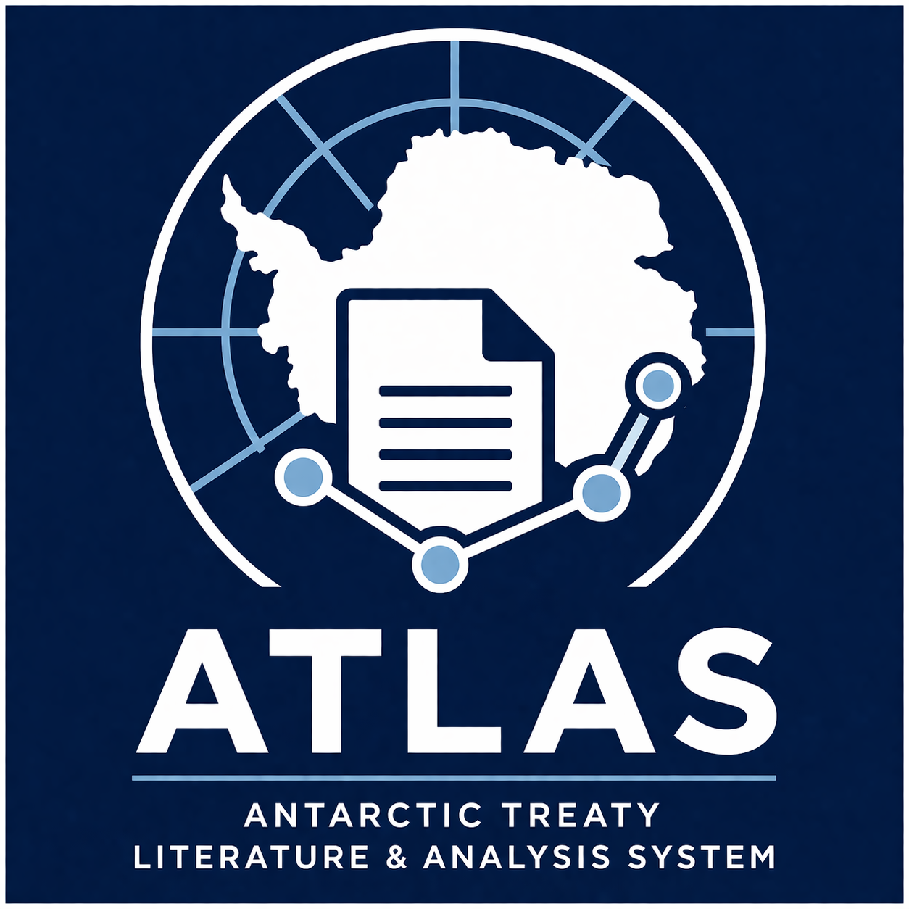

<p align="center">
  <br>
  <strong>ATLAS</strong><br>
  Antarctic Treaty Literature & Analysis System
</p>

ATLAS is a small toolkit for tracing how Antarctic Treaty final reports connect
**papers**, **agenda items**, and **formal outputs**.

In practice, it helps answer questions like:
- what supported a given Decision, Measure, or Resolution?
- which papers sat under a given item?
- what outputs can be linked back to a paper?

ATLAS is built as a Python package with a simple CLI.

## Data

The extraction data lives in a separate repo, `ATLAS-data`. It is not a Python
package dependency; ATLAS just reads files from that data directory.

ATLAS looks for data via:

```bash
ATLAS_DATA_DIR
```

If that is not set, it defaults to:

```bash
../ATLAS-data
```

If the data repo is missing, you can bootstrap it with:

```bash
python -m atlas.support_tracer_cli init-data
```

## Basic use

Build parser tables:

```bash
python -m atlas.parse_marker_full_pagewise
```

Export a manual-validation bundle from the rule-based links:

```bash
python -m atlas.support_tracer_cli export-validation --output-path validation_bundle.json
```

Or classify item content with Gemma (`gemma-4-26b-a4b-it`) and export an LLM validation bundle. This extracts:
- direct paper -> output links inferred from the item text

Then run:

```bash
python -m atlas.support_tracer_cli classify-items-llm --limit 30 --workers 4
```

Then open `manual_validation.html` in a browser and load the exported JSON file.
The validator shows the selected case alongside a deduplicated item-level graph:
paper(s) -> item entry/entries -> outcome(s). Click an edge to approve, reject,
correct, or skip that inference. Review downloads include
`claim_review_rows` and `edge_review_rows` so paper-to-item and
item-to-outcome validity can be reconstructed without re-opening the browser
state.

Build the backend:

```bash
python -m atlas.support_tracer_cli build-db
```

Query an output:

```bash
python -m atlas.support_tracer_cli output "Decision 1 (2004)"
```

Query an item:

```bash
python -m atlas.support_tracer_cli item ATCM27_full_pagewise 5 --sequence-type atcm
```

Query a paper:

```bash
python -m atlas.support_tracer_cli paper WP-48
```

## Python

```python
from atlas import build_or_refresh_database, query_by_output

build_or_refresh_database()
result = query_by_output("Decision 1 (2004)")
```

## Normalized paper extraction

ATLAS exposes a utility layer for working with extracted paper references from
item-level LLM outputs, especially where the same working paper appears in
inconsistent forms such as:

- `WP-1`
- `WP-01`
- `ATCMXLIV WP-1`
- `ATCM XLIV WP-01`
- references to a paper from another meeting year embedded in the current item

The normalization rule is:

- treat the meeting marker `ATCM[number-or-roman]` as the session anchor
- normalize paper labels into structured fields rather than relying only on raw
  strings
- group working papers relative to the main meeting marker for the item being
  processed

This is useful because `WP-1` and `WP-01` resolve to the same canonical paper
within a meeting, while `ATCMXLIV WP-1` remains distinguishable as a
cross-meeting reference when the current item belongs to another ATCM.

We should apply the same idea to formal outputs. In practice, output labels such
as `Decision 1 (2004)` should not only be normalized as strings, but also be
scoped to the meeting context so they can be grouped relative to the relevant
`ATCM[number]`. This matters because the same output family is interpreted in
relation to a specific meeting, just as working papers are.

Install the package in editable mode during development:

```bash
pip install -e .
```

### Load and inspect the dataset

```python
from atlas import load_paper_dataset

ds = load_paper_dataset()
print(ds)
```

The dataset object supports:

- `ds.links` — full normalized link table
- `ds.papers` — unique normalized papers
- `ds.meetings` — per-meeting summary
- `ds.links_for_meeting(meeting_number)`
- `ds.links_for_paper(paper_label, meeting_number=None)`
- `ds.outputs_for_paper(paper_label, meeting_number=None)`
- `ds.papers_for_output(output_label)`
- `ds.adjacency()`

By default, links marked with `evidence_basis="joint_discussion"` are excluded from
the normalized dataset because they are often too diffuse to support a clean
paper-to-output assignment. If you want to test whether those broader
co-discussion links help connect parts of the graph, ATLAS should expose a flag
to include them when loading or building the dataset, for example:

- `load_paper_dataset(..., include_joint_discussion=True)`

This is useful as a diagnostic switch when the graph appears too fragmented and
you want to see whether the missing connectivity is caused by filtering out
jointly discussed papers.

### Convert the dataset to a graph

You can convert the dataset into a single graph spanning all meetings by
default, and optionally subset it to one or more meetings before graph
construction.

Typical usage:

```python
from atlas import load_paper_dataset

ds = load_paper_dataset()

g_all = ds.to_graph()
g_27 = ds.to_graph(meeting_number=27)
g_subset = ds.to_graph(meeting_number=[27, 28])
```

Expected behavior:

- `ds.to_graph()` builds one graph over the full normalized dataset
- `meeting_number=None` means use all meetings
- `meeting_number=27` restricts the graph to `ATCM27`
- `meeting_number=[27, 28]` restricts the graph to those meetings only
- if a dataset was loaded with `include_joint_discussion=True`, those additional
  links should also appear in the graph

The graph is built from normalized paper-to-output links, so each graph
contains:

- paper nodes
- output nodes
- edges from normalized paper labels to normalized output labels

Both sides of the graph are ATCM-scoped. That means papers are grouped by
their normalized meeting-aware labels, and outputs are also normalized relative
to the relevant `ATCM[number]` context rather than treated as only plain
labels.

A typical workflow is:

```python
from atlas import load_paper_dataset

ds = load_paper_dataset()

g = ds.to_graph()
g_meeting = ds.to_graph(meeting_number=44)

meeting_links = ds.links_for_meeting(44)
```

This keeps one canonical graph interface while still allowing meeting-level
subsetting from the same dataset object.

### Output normalization is also meeting-aware

The same normalization principle used for papers is also applied to Decisions,
Measures, and Resolutions. A practical normalized output record includes:

- normalized output type
- normalized output number
- normalized output year
- canonical output label such as `Decision 1 (2004)`
- ATCM meeting scope such as `ATCM27`

This makes it possible to:
- group outputs under the same meeting anchor as the papers
- build meeting-specific subgraphs cleanly
- distinguish global string normalization from meeting-aware graph identity

So the intended model is not just:

- `ATCM27:WP-1 -> Decision 1 (2004)`

but rather conceptually:

- `ATCM27:WP-1 -> ATCM27:Decision 1 (2004)`

even if the human-readable label remains `Decision 1 (2004)`.

### Item graph for cross-meeting flow

Working papers are local to the meeting in which they were submitted. That
means `ATCM27:WP-1` and `ATCM28:WP-1` are different papers, even though they
share the same local submission number. If the goal is to study how discussion
flows across meetings, the paper-output graph is not the right object on its
own.

For cross-meeting continuity, the relevant unit is still the agenda item, but
item numbers are only meaningful within a given meeting. In other words:

- `ATCM27:item5` and `ATCM28:item5` are different local agenda entries
- item numbers should not be used by themselves to infer continuity across meetings
- a later item may refer back to earlier outputs, papers, or discussions, but
  that must be established from evidence rather than from matching item numbers

The intended item-centered model is:

- papers are local evidence objects within a meeting
- outputs are formal products associated with a meeting context
- items are meeting-local agenda entries
- cross-meeting continuity, if inferred, must come from explicit references,
  shared outputs, or stronger semantic evidence, not from reused item numbers

Conceptually, this means we should not create cross-meeting edges just because
two items share the same local number. For example, we should not assume:

- `ATCM27:item5 -> ATCM28:item5`

unless there is separate evidence that the later item continues the earlier
discussion.

We also should not try to connect:

- `ATCM27:WP-1 -> ATCM28:WP-1`

because those are different submissions.

A practical item graph should therefore support:

- item nodes such as `ATCM27:item5`
- optional paper nodes such as `ATCM27:WP-1`
- optional output nodes such as `ATCM27:Decision 1 (2004)`
- within-meeting edges like `paper -> item` and `item -> output`
- cross-meeting reference or lineage edges only when supported by evidence

Typical intended usage is:

```python
from atlas import load_paper_dataset

ds = load_paper_dataset()

g_items = ds.to_item_graph()
g_items_27_28 = ds.to_item_graph(meeting_number=[27, 28])
```

The purpose of this graph is different from `ds.to_graph()`:

- `ds.to_graph()` is a local paper-output graph
- `ds.to_item_graph()` is an item-centered graph for inspecting within-meeting
  structure and any evidence-based cross-meeting references

This distinction matters because disconnected paper graphs across meetings are
often expected, and item graphs should also remain disconnected unless there is
actual evidence linking discussions across meetings. Matching item numbers alone
is not such evidence.

If you suspect the graph is too disconnected because broad co-discussion links
were filtered out, a useful diagnostic is to rebuild or reload the dataset with
joint-discussion links included. That should be treated as an exploratory mode,
not as the default analytical setting, because it may introduce weaker and less
specific connections.

After installation, the normalization, dataset, and graph utilities should be
available directly from `atlas`.
